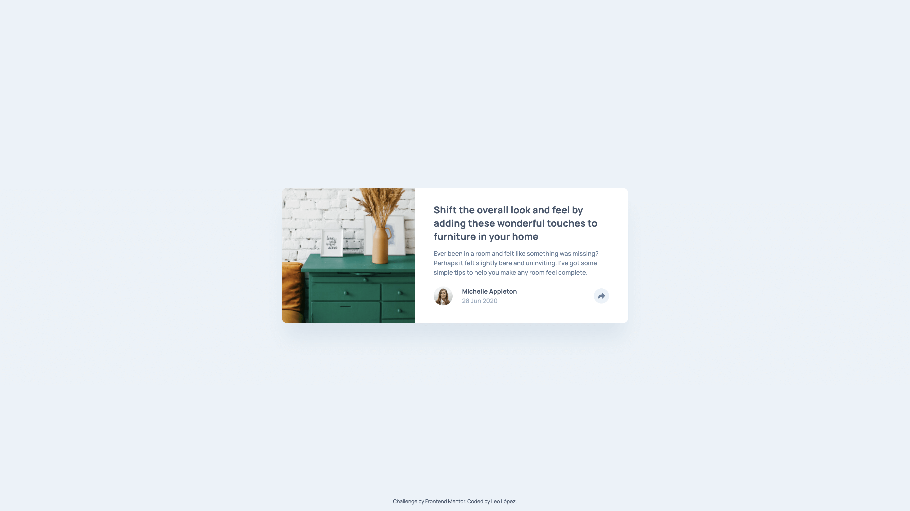

# Frontend Mentor - Article Preview Component

This is a solution to [Article Preview Component](https://www.frontendmentor.io/challenges/article-preview-component-dYBN_pYFT) challenge of Frontend Mentor.

Frontend Mentor challenges help you improve your coding skills by building realistic projects.

## Table of contents

- [Frontend Mentor - Article Preview Component](#frontend-mentor---article-preview-component)
  - [Table of contents](#table-of-contents)
  - [Overview](#overview)
    - [Screenshot](#screenshot)
    - [Links](#links)
    - [Built with](#built-with)
  - [Author](#author)

## Overview

### Screenshot

### Links

- Solution URL: [https://www.frontendmentor.io/solutions/article-preview-component-jE08Y4LMR1](https://www.frontendmentor.io/solutions/article-preview-component-jE08Y4LMR1)
- Live Site URL: [https://ciensprog.github.io/FM-008-Article-Preview-Component/](https://ciensprog.github.io/FM-008-Article-Preview-Component/)

### Built with

- Semantic HTML5 markup
- [Tailwindcss](https://tailwindcss.com) - Utility-first CSS Framework
- [React](https://reactjs.org/) - JS library
- [Vite](https://vitejs.dev) - Frontend Tooling

## Author

- Frontend Mentor - [@Ciensprog](https://www.frontendmentor.io/profile/Ciensprog)
- Twitter - [@Ciensprog](https://www.twitter.com/Ciensprog)
